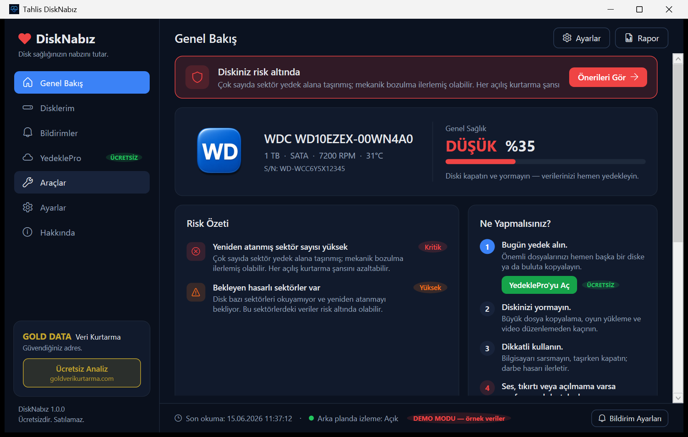
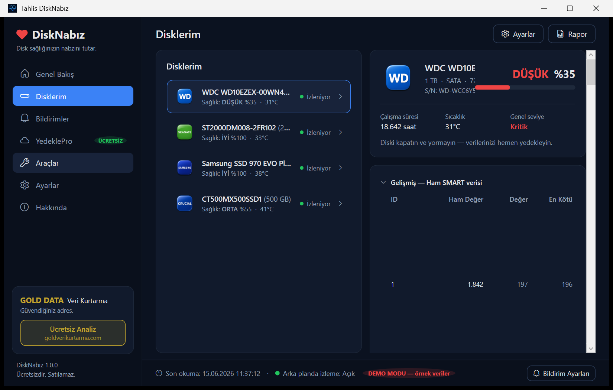
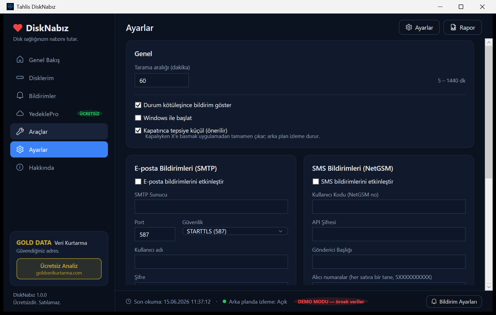
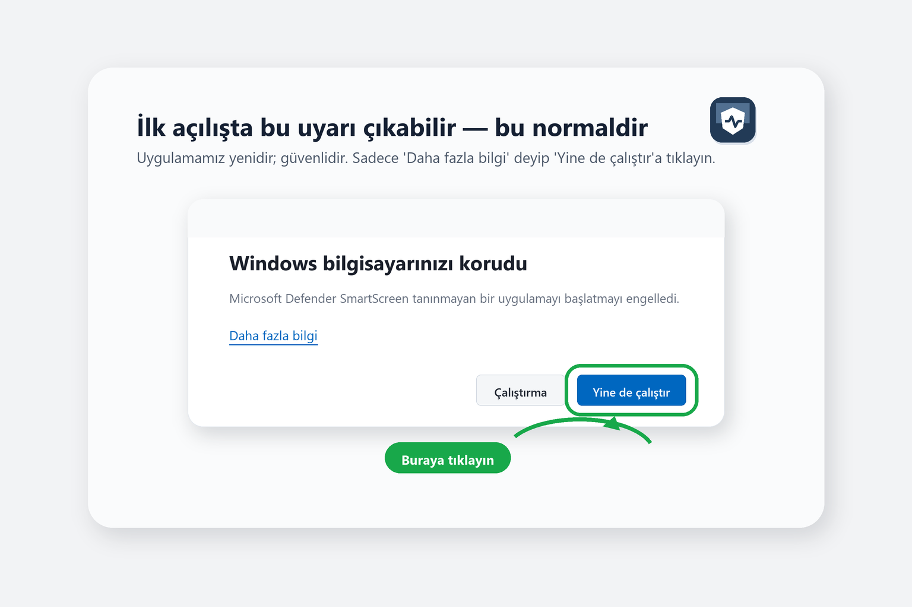

# Tahlis™ DiskNabız

**Disk sağlığınızın nabzını tutar.** Sabit disk ve SSD'lerinizin S.M.A.R.T.
verilerini okuyup, teknik tablolar yerine **düz Türkçe** ve anlaşılır bir risk
raporu sunan ücretsiz Windows uygulaması. **Yalnızca teşhis yapar** (diske
hiçbir yazma işlemi yapmaz) ve **hiçbir telemetri toplamaz.**

## ⬇️ İndir

### **[➡️ DiskNabız'ı İndir (Windows 10/11, 64-bit)](https://github.com/datarecoveryexpert/disknabiz-downloads/releases/latest/download/DiskNabiz-Setup.exe)**

Kurulum tamamen Türkçedir. Tüm sürümler için [Releases](https://github.com/datarecoveryexpert/disknabiz-downloads/releases) sayfasına bakın.

> Bu depo yalnızca **kurulum dosyalarını** barındırır. Uygulama kaynak kodu
> özeldir ve burada yer almaz.

## 📸 Ekran Görüntüleri

### Genel Bakış — tek bakışta risk durumu
Her disk için 4 kademeli risk (Sağlıklı / İzlenmeli / Riskli / Kritik), yüzde
sağlık skoru ve "ne yapmalısınız?" yönlendirmesi.

### Disklerim — ham S.M.A.R.T. verisi, Türkçe açıklamalı
Tüm diskleriniz tek listede; gelişmiş görünümde ham S.M.A.R.T. değerleri
İngilizce kodlar yerine Türkçe adlarla, her satırda "ne anlama geliyor?"
açıklamasıyla.

### Ayarlar — e-posta / SMS uyarıları
Disk sağlığı kötüleşince e-posta (SMTP) veya SMS (NetGSM) ile uyarı alın.
Kimlik bilgileri Windows DPAPI ile şifreli saklanır.

## ✨ Öne çıkanlar

- **Düz Türkçe risk raporu** — hex tablolar değil, anlaşılır durum kartları
- **4 kademeli risk + yüzde sağlık skoru** ve eğilim takibi
- **Tüm disk türleri:** SATA HDD/SSD, NVMe, USB harici — her biri için Türkçe
  açıklamalı ham S.M.A.R.T.
- **Marka tanıma:** bağlı diskin markasına göre rozet (Samsung, WD, Seagate,
  SanDisk, Kingston, Crucial, Toshiba, Transcend, ADATA, Kioxia…)
- **Sessiz arka plan izleme:** sistem tepsisinde çalışır, kötüleşmede bildirim
- **E-posta / SMS uyarıları** (şifreli kimlik bilgileri)
- **Telemetri yok, yalnızca teşhis** — verileriniz cihazınızdan çıkmaz, diske
  asla yazılmaz

## ⚠️ İlk açılışta bir uyarı görebilirsiniz — bu normaldir

Uygulama yeni olduğu için, Windows ilk çalıştırmada **"Windows bilgisayarınızı
korudu"** uyarısını gösterebilir. Bu, uygulamanın zararlı olduğu anlamına
gelmez; yalnızca henüz yeterince yaygın indirilmediği içindir. Açmak için:
**Daha fazla bilgi → Yine de çalıştır.**

## 🔒 Gizlilik

- **Telemetri yok:** disk seri numaraları ve S.M.A.R.T. değerleri hiçbir
  sunucuya gönderilmez; tüm veriler yalnızca sizin cihazınızda kalır.
- **Yalnızca okuma:** uygulama diskinize hiçbir yazma/onarım işlemi yapmaz.

## İletişim

Web: <https://tahlis.com.tr> · GOLD DATA Teknoloji

© 2026 GOLD DATA Teknoloji — Tüm hakları saklıdır.
